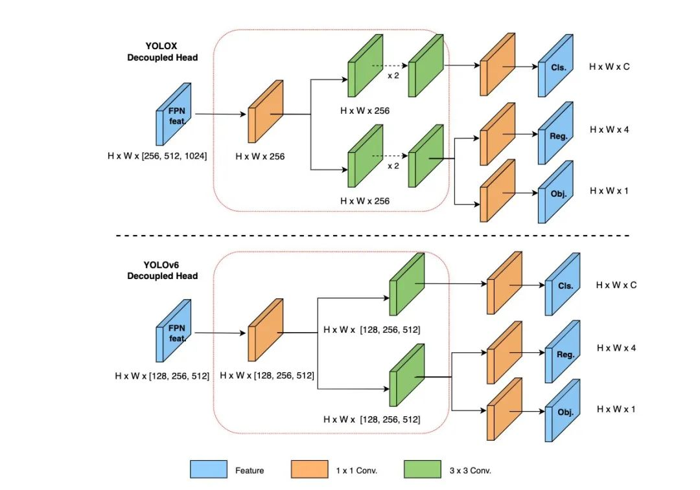

参考链接：https://mp.weixin.qq.com/s/RrQCP4pTSwpTmSgvly9evg  
论文地址：[https://arxiv.org/abs/2209.02976（YOLOv6）](https://arxiv.org/abs/2209.02976%EF%BC%88YOLOv6%EF%BC%89)  
https://arxiv.org/abs/2301.05586 (YOLOv6 3.0)

# 特点

1.  anchor free
2.  标签分配：simOTA
3.  回归损失：SIOU
4.  骨干：EiffenetRep
5.  PAN：Rep-PAN
6.  Head：解耦头
7.  训练含有Anchor辅助训练

# RepVGG

1.  论文地址：https://arxiv.org/abs/2101.03697
2.  附件：[2101.03697.pdf](:/a2d5b0e1922e422bbe9bcf231b15eff1)

## 主要特点

主要概括为训练时的网络结构为多分支结构，但推理时能够像VGG那样堆叠$$3\times3$$的卷积，将训练和推理的结构相解耦，能够大大缩短推理时间。RepVGG 模型的运行速度(RepVGG-A2)比 ResNet-50 快 83% 或(RepVGG-B1g4)比 ResNet-101 快 101%，精度更高，并且与 EfficientNet 和 RegNet 等最先进的模型相比，在精度与速度之间取得了良好的平衡。  


## 开发灵感

复杂的神经网络结果会增加内存开销，也可能在某些设备上缺乏相关支持，影响推理速度，浮点操作数(FLOPs)不能准确地反映实际速度，拥有低浮点操作数(FLOPs)的模型推理速度不一定更快。

### Flops和速度上的差异可以归因于：

1.  内存访问成本 (MAC) 。例如，虽然分支加法或连接所需的计算量可以忽略不计，但 MAC 却很重要。在分组卷积中，MAC用时很长
2.  并行度

### 内存更经济

多分支的内存消耗更多，因为每个分支的结果都要现保存用于后面的加操作或Concat操作。普通的拓扑结构允许特定层输入占用的内存在操作完成候立即释放

### 更灵活

多分支拓扑对架构约束更多，例如每个残差结构块的最后一层要求都一样，否则shortcut连接将不成立。还有多分支拓扑让裁剪变得困难，裁剪后会产生显著的性能下降和低加速比。普通架构允许我们自由配置每一个卷积层，进行修剪获得更好的性能。

## 技术细节

### Repvgg结构概览

训练时，受ResNet启发，RepVGG使用相同的$$1\times1$$分支，但在推理时，重参数化操作可以消除$$1\times1$$分支，转换后的模型由$$3\times3$$的卷积的卷积堆叠而成。


### Repvgg重参过程

如图所示，训练时，Repvgg结构块有一个$$3\times3$$卷积分支，一个$$1\times1$$卷积分支，一个identity分支(即原来的输入)，推理重构时，先将3个分支分别与BN层融合，融合后将$1\times1$卷积分支和identity分支转换成$$3\times3$$的卷积，其中$$1\times1$$卷积分支将数值填在$3\times3$卷积的正中央，identity分支每个卷积核将对应输入channel(一个)的$$3\times3$$矩阵中心位置置1，其余置0。  


#### 问题解答

1.  为和$$C_2 = C_1 = 2$$时$$3\times3$$矩阵有四个？  
    因为卷积核的通道数量必需与输入相同，即每个卷积核2个通道，由于输出的通道数是2，则需要两个卷积核，因此$$2\times2=4$$个$$3\times3$$矩阵。参考链接：https://zhuanlan.zhihu.com/p/251068800

### 代码定位

[https://github.dev/DingXiaoH/RepVGG](https://github.dev/DingXiaoH/RepVGG)
以下RepVGGBlock类里的函数比较重要，分别是将$$1\times1$$卷积核扩充到$$3\times3$$卷积核和融合bn模块

```python
    def _pad_1x1_to_3x3_tensor(self, kernel1x1):
        if kernel1x1 is None:
            return 0
        else:
            return torch.nn.functional.pad(kernel1x1, [1,1,1,1])

    def _fuse_bn_tensor(self, branch):
        if branch is None:
            return 0, 0
        if isinstance(branch, nn.Sequential):
            kernel = branch.conv.weight
            running_mean = branch.bn.running_mean
            running_var = branch.bn.running_var
            gamma = branch.bn.weight
            beta = branch.bn.bias
            eps = branch.bn.eps
        else:
            assert isinstance(branch, nn.BatchNorm2d)#针对identity分支
            if not hasattr(self, 'id_tensor'):
                input_dim = self.in_channels // self.groups
                kernel_value = np.zeros((self.in_channels, input_dim, 3, 3), dtype=np.float32)
                for i in range(self.in_channels):
                    kernel_value[i, i % input_dim, 1, 1] = 1
                self.id_tensor = torch.from_numpy(kernel_value).to(branch.weight.device)
            kernel = self.id_tensor
            running_mean = branch.running_mean
            running_var = branch.running_var
            gamma = branch.weight
            beta = branch.bias
            eps = branch.eps
        std = (running_var + eps).sqrt()
        t = (gamma / std).reshape(-1, 1, 1, 1)
        return kernel * t, beta - running_mean * gamma / std

    def switch_to_deploy(self):
        if hasattr(self, 'rbr_reparam'):
            return
        kernel, bias = self.get_equivalent_kernel_bias()
        self.rbr_reparam = nn.Conv2d(in_channels=self.rbr_dense.conv.in_channels, out_channels=self.rbr_dense.conv.out_channels,
                                     kernel_size=self.rbr_dense.conv.kernel_size, stride=self.rbr_dense.conv.stride,
                                     padding=self.rbr_dense.conv.padding, dilation=self.rbr_dense.conv.dilation, groups=self.rbr_dense.conv.groups, bias=True)
        self.rbr_reparam.weight.data = kernel
        self.rbr_reparam.bias.data = bias
        self.__delattr__('rbr_dense')
        self.__delattr__('rbr_1x1')
        if hasattr(self, 'rbr_identity'):
            self.__delattr__('rbr_identity')
        if hasattr(self, 'id_tensor'):
            self.__delattr__('id_tensor')
        self.deploy = True
```


# YOLOv6

## 网络结构


### RepBlock、RepConv和CSPStackRep Block模块

其中RepBlock适用于小模型，CSPStackRep Block适用于大模型(避免大网络中单路径模型的计算成本和参数数量呈指数增长)。  


### Neck

用Repblock代替YOLOv5的CSP-block(小模型)，或用CSPStackRep Block代替(大模型)

### Head

#### Decoupled head

采用 Hybrid Channels 策略重新设计了一个更高效的解耦头结构，在维持精度的同时降低了延时，缓解了解耦头中 3x3 卷积带来的额外延时开销。通过在 nano 尺寸模型上进行消融实验，对比相同通道数的解耦头结构，精度提升 0.2% AP 的同时，速度提升6.8%。  


#### Anchorfree

YOLOv6采用基于锚点的范式，其框回归分支实际上预测了锚点到边界框四边的距离

## 标签分配

使用TAL作为默认标签分配策略

## 损失函数

### 类别损失

采用VFL(VariFocal Los)

### 回归损失

1.  基于IOU的损失：SIOU或GIOU
2.  基于可能性的损失：DFL

# YOLOv6(3.0)

## YOLOv6新的特征总结

- RepBi-PAN代替Rep-PAN:使用BiC( Bi-directional Concatenation)模块提供更准确的定位信号。
- SPPF模块被简化成SimCSPSPP模块，带来性能提升，带来一点点的速度下降(可忽略不计)
- 新增锚点辅助训练(AAT)策略，能够同时带来锚点和无锚点范式的优势
- 加深YOLOV6网络，在主干和颈部网络中加入其他的步骤
- 采用了一种新的自蒸馏策略来提高 YOLOv6 小型模型的性能，在推理时去处辅助回归分支

| YOLOv6 |  |
| --- | --- |
| YOLOv6(3.0) |  |

## 锚点辅助训练

锚点训练带来的性能更强，引入锚点辅助训练，在训练阶段，辅助分支和无锚分支从独立的损失中学习，同时信号一起传播。因此，来自辅助分支的附加嵌入式引导信息被集成到主无锚头中。推理时移除辅助分支。  

